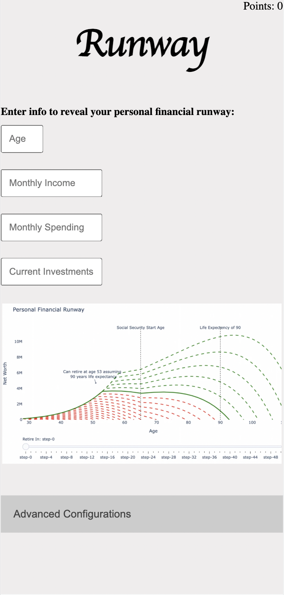

# Project 1 - Runway!

## Overview Description

My app is called "Runway". It is an app for those aspiring to get a better hold on their own personal finances in a way that is personalized, engaging, and educational. In a nutshell, it allows users to input information pertaining to their own financial situation and it computes a "personal financial runway" for them which calculates when they might be able to retire.

---

## Technology Used

- Event listeners
- Multiple HTML files referencing multiple js files
- Usage of local storage in the browser
- Tooltip popups
- window object
- sliders
- Various CSS tricks

## MVP goals

- App allows user to input age, monthly income, monthly spending, and current investments and the app returns a graph for their own runway.

- In an expandable "advanced configurations" section, users are allowed to adjust many of the default variables.

- Advanced configs include Expected return on investment accounts, Expected Inflation rate, Expected age to begin drawing from social security, and Life Expectency.

- In order to unlock the ability to change each of these each of these advanced configs, users must read information about what that particular config does, and then answer a multiple choice question about it.

- Once that is done, the feature is unlocked and the user is awarded some "points" as well.

- Points will be displayed in the top right of the main screen.

- The "unlocking" ability will be made apparent when the user clicks a tooltip next to each advanced config.

- Use media queries to make the app responsive.

- Each field has trivia that is going to have mulitple chboice questions which, when answered correctly, will award user points, give some sort of badge, and have a "win" state of some kind.

- If user gets certain amount wrong, gets a "try again" message or something like that. Need a "lose" state.

- Maybe make a 'misc trivia' part that doesn't have anything to do with the adv configurations.

### Getting Started

- Go to https://runwaygame.netlify.app/
- In this release of the app, the chart doesn't actually work so you will have to use your imagination! But the buttons all work.

### Next steps

I intend to:

- Get chart working
- Have user inputs get sent into a DB
- Continue polishing CSS to make the UX pop more
- Create log in and saved user history
- More advanced features